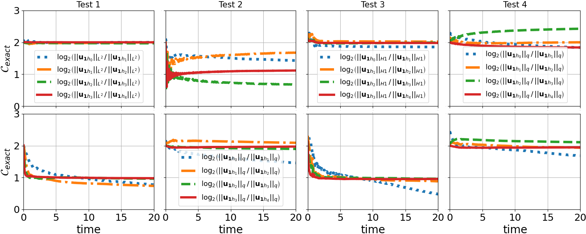
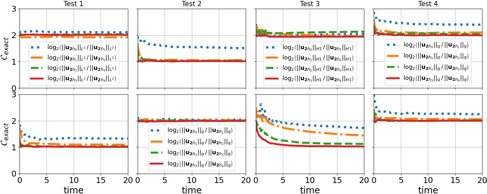
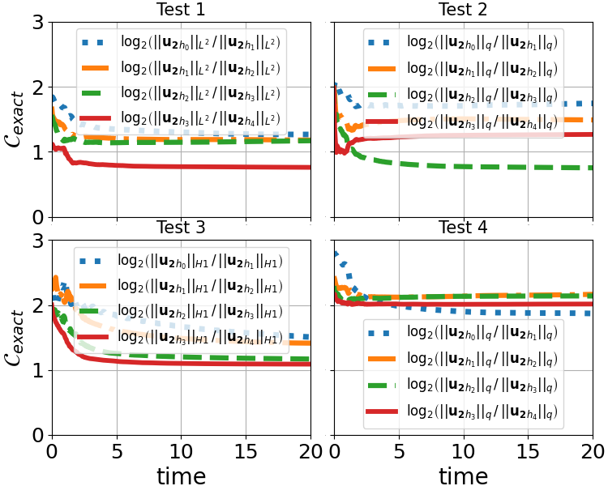
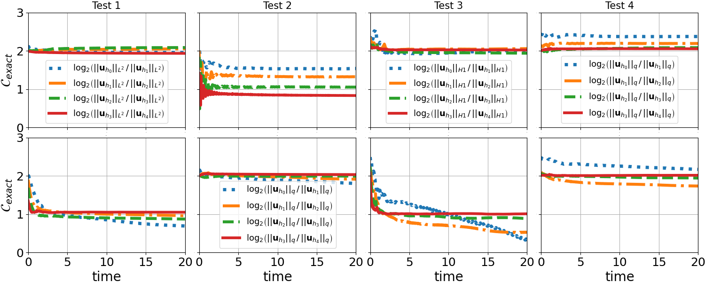
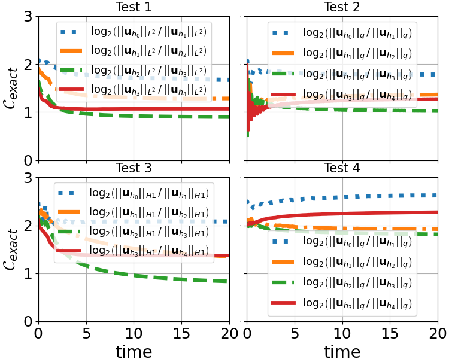
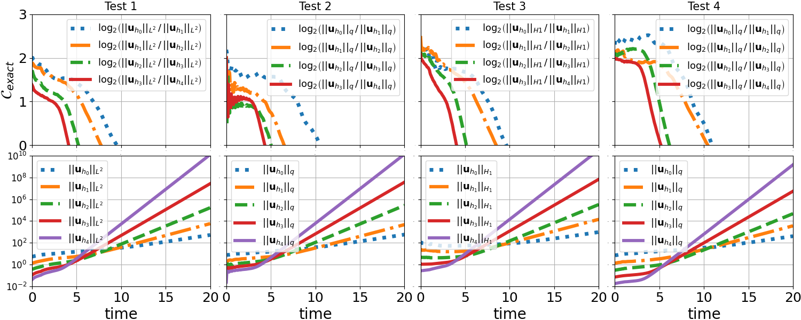
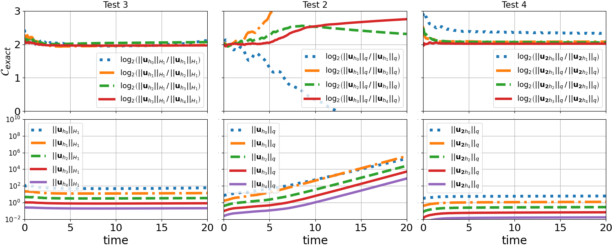
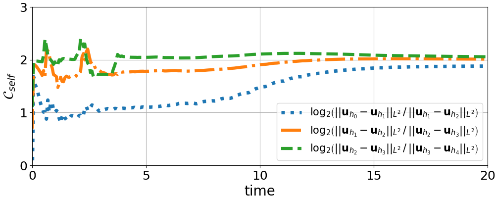

# Toy models for Cauchy-Characteristic Extraction (CCE) and Matching (CCM)
 
This repository contains the code used in the paper [arXiv:2306.13010](https://arxiv.org/abs/2306.13010).
The goal of this work is to analyze the numerical
convergence of CCE and CCM for toy models that mimic the hyperbolic
structure of the general relativistic PDE systems used in CCE and
CCM. The implemented models are the following:

- for the Initial Boundary Value Problem (IBVP):
$$\partial_t \phi_1 = - v_{\phi_1} \partial_\rho \phi_1 + a_{z11} \partial_z \phi_1 + a_{z12} \partial_z \psi_{v 1} + a_{z13} \partial_z \psi_1 + b_{11} \phi_1 + b_{12} \psi_{v 1} + b_{13}\psi_1 $$ 

$$\partial_t \psi_{v1} = - v_{\psi_{v1}} \partial_\rho \psi_{v1} + a_{z21} \partial_z \phi_1 + a_{z22} \partial_z \psi_{v 1} + a_{z23} \partial_z \psi_1 + b_{21} \phi_1 + b_{22} \psi_{v 1} + b_{23}\psi_1 $$

$$\partial_t \psi_1 = v_{\psi_1} \partial_\rho \psi_1 + a_{z31} \partial_z \phi_1 + a_{z32} \partial_z \psi_{v 1} + a_{z33} \partial_z \psi_1 + b_{31} \phi_1 + b_{32} \psi_{v 1} + b_{33}\psi_1 $$

- for the Characteristic Initial Boundary Value Problem (CIBVP):
$$\partial_x \phi_2 = a_{z11} \partial_z \phi_2 + a_{z12} \partial_z \psi_{v 2} + a_{z13} \partial_z \psi_2 + b_{11} \phi_2 + b_{12} \psi_{v 2} + b_{13}\psi_2 $$ 

$$\partial_x \psi_{v2} = a_{z21} \partial_z \phi_2 + a_{z22} \partial_z \psi_{v 2} + a_{z23} \partial_z \psi_2 + b_{21} \phi_2 + b_{22} \psi_{v 2} + b_{23}\psi_2 $$

$$\partial_u \psi_2 = v_{\psi_2} \partial_\rho \psi_2 + a_{z31} \partial_z \phi_2 + a_{z32} \partial_z \psi_{v 2} + a_{z33} \partial_z \psi_2 + b_{31} \phi_2 + b_{32} \psi_{v 2} + b_{33}\psi_2 $$

The fields $\phi_1, \psi_{v1}, \phi_2, \psi_{v2}$ are left-moving,
whereas $\psi_1, \psi_2$ right-moving. The paremeters $v_{\phi_1},
v_{\psi_{v1}}, v_{\psi_1}, v_{\psi_2}$ control the speeds of the
fields and should receive only positive values to maintain the
direction of propagation of the fields, as well as the correct
prescription of boundary data. The speeds of $\phi_2, \psi_{v2}$ are
fixed to $1$. The parameters $a_{zij}, b_{ij}$, with $i,j=1,2,3$,
control the angular principal part and sources of the systems,
respectively, and can be tuned independently for the IBVP and CIBVP.

In the paper, the speeds of propagation are fixed to $\phi_1 =
\psi_{v1} = \psi_1 = 1$ and $\psi_2 = 0.5$. Furthermore, the models
explored are the symmetric hyperbolic $a_{z12}=a_{z21}=a_{z33}=1$, and
the weakly hyperbolic $a_{z21}=a_{z33}=1$, with the rest of the
$a_{zij}$ vanishing in each case. Regarding source terms, the
following cases are explored:
+ homogeneous i.e. $b_{ij} = 0$ for all $i,j$
+ inhomogeneous with only non-vanishing $b_{13}=1$
+ inhomogeneous with only non-vanishing $b_{32}=1$

The code is written in the [Julia programming
languange](https://julialang.org/) as a module, and
tested in Julia version 1.8.5.

## Installation

After you have installed Julia and downloaded the repository
"model_CCE_CCM_public", change to your local directory where the
repository is saved. The module can be installed using Julia's REPL
mode. To enter Julia's REPL open your terminal and run "julia". Then
do:

```
julia> ]
pkg> add .
```

## Usage

This section gives the recipe to create the convergence plots
presented in the paper.

+ Open your terminal
+ Change to the directory "./examples"
+ Let's assume you want to run the CCM model for noisy given data,
that is the script "./examples/run_ccm_noise.jl". To do so, you need
to run in your terminal
```
julia run_ccm_noise.jl
```
To perform the convergence tests, you need to run the same script for
different resolutions. The resolution of a run is controlled by the
parameter "D" in the script. There are more parameters in the script
that control e.g. the degree of hyperbolicity of the IBVP and CIBVP,
their source terms etc. See "./examples/REAME.md" for more details, as
well as the comments within the script.

The norms (L2, q, and H1) are calculated with the Julia scripts in
"./tools" and plotted with the Jupyter notebooks in the same
directory. For example, to reproduce Fig.8-10, you first need to run
the noisy CCM script for SYMH-SYMH, WH-WH, SYMH-WH, and SYMH B1-WH B2,
for resolutions D=0,1,2,3,4 for each case. Then, you need to run
scripts "./tools/L2_norm_exact_ccm.jl" and "dev_norms_exact_ccm.jl",
one time for each case (you need to appropriately change the path that
points to each directory with the relevant data, in each of the two
scripts). Then, you can produce the figures by running the Jupyter
notebook "./tools/tests_1234_noise_ccm.ipynb", where you have to
change again the paths to point to the directories where the norms are
saved. See "./tools/README.md" for more details.


## Convergence plots: boundary data via time derivative

The paper presents convergence tests for noisy given data, for a
numerical algorithm were the boundary data are provided as an
injection on the relevant function. Another technique to prescribe
boundary data is to provide the time derivative of the relevant
function, and not the function itself. The results however are
qualitatively the same in both cases. The convergence tests for the
second prescription of boundary data (via time derivative) are:

1) homogeneous IBVP: SYMH top and WH bottom (compare to FIG. 5 in the
paper)


2) homogeneous CIBVP: SYMH top and WH bottom (compare to FIG.6 in the
paper)


3) homogeneous SYMH-WH CCE: the WH CIBVP part (compare to FIG. 7 in
the paper)


4) homogeneous CCM: SYMH-SYMH top and WH-WH bottom (compare to FIG. 8
in the paper)


5) homogeneous CCM: SYMH-WH (compare to FIG. 9 in the paper)


6) inhomogeneous CCM: SYMH B1-WH B2 (compare to FIG. 10 in the paper)


7) for comparison with 6): SYMH B1-SYM B2 left, WH B1-WH B2
middle, and on the right the CIBVP part for CCE with SYMH B1-WH B2 (compare to
FIG. 11 in the paper)


Comparing the above with the ones presented in the paper, one can see
that the method used to prescribe boundary data does not affect the
results (at least for the two methods explored).


## Convergence plots: smooth data

In the paper we focus on tests with noisy given data, since these are
important to detect the effect of weak hyperbolicity in numerical
experiments. We further argued that one might miss this effect with
only smooth data, as for instance was seen in [arxiv
2007.06419](https://arxiv.org/abs/2007.06419). For completeness, we
perform smooth convergence tests for both boundary data methods, for
the setup that exhibit complete loss of convergence with noisy data,
that is CCM with SYMH B1-WH B2. We present below the self convergence
rate in the L2 norm. In the directory "./tools" one can find a Jupyter
notebook that performs a pointwise convergence analysis.

1) Boundary data provided via injection:


2) Boundary data provided via time derivative:

