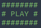

# Usage

This directory contains scripts that run the simulations and produce
the data to be used for the convergence analysis. The convergence
analysis is performed after the runs are finished and is taken care of
by scripts in the directory "../tool/".

The scripts here perform simulations for:
+ "run_ccm_noise.jl": CCM with noisy given data 
+ "run_ccm_smooth.jl": CCM with smooth given data 
+ "run_cce_noise.jl": CCE with noisy given data 
+ "run_ibvp_cibvp_noise.jl": IBVP and CIBVP independently, with noisy given data 

Within these scripts and below the sign

there are various parameters of the simulations, which you need to
tune according to your goal. The parameters set the folder name where
data are stored, the number of points of the numerical grid and the
grid size itself, the CFL condition, as well as the hyperbolic
structure and sources of the IBVP and CIBVP. After deciding on the
model that you want to test (e.g. CCM for homogeneous SYMH IBVP and
SYMH CIBVP with noisy data), you have to perform the same run with
increasing resolution in order to obtain appropriate data for the norm
convergence tests. The only parameter that needs to be tuned for the
different runs is "D", which is an integer and controls the times that
the base (coarse) grid resolution (number of points) is doubled.
