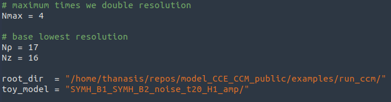

# Post-processing

This directory contains scripts that perform post-processing of the
simulations' data, for the different convergence tests. The Julia
scripts (.jl) calculate the various norms that are tested, and save
them in a ".dat" format. The Jupyter notebooks (.ipynb) produce the
plots of the data that the Julia scripts produce. In both cases, you
need to provide the correct path for the loaded data.

For the Julia scripts, you need to tune the following parameters:

For example, let's assume you want to reproduce Fig. 8, 9, and 10 of
the paper. These Figures are produced by the Jupyter notebook
"tests_1234_noise_ccm.ipynb". First you need to generate the relevant
data, that is:

+ run the example "../examples/run_ccm_noise.jl" for the different
setups (SYMH, WH, homogeneous, inhomogeneous), for different
resolutions. Be careful to choose appropriately the rate that the
noise amplitude drops with increasing resolutions. Remember that this
rate is 1/4 for every variable that appears with no derivative in the
norm, and 1/8 for every variable that appears with a derivative in the
norm. 

+ Run the scripts "L2_norm_exact_ccm.jl" and "dev_norms_exact_ccm.jl"
for the different cases. The first script computes a norm with no
derivatives, whereas the second computes two different norms that
include derivatives, but in different compinations. Be careful to
point to the appropriate data directory.

+ Run the Jupyter notebook "tests_1234_noise_ccm.ipynb". Note that in
this notebook, as well as the norm scripts, the default assumption is
that you have run the same PDE problem for D=0,1,2,3,4. The higher the
value of D, the longer the simulations. If you want to perform the
tests faster, stop at lower D and change appropriately the parameters
in the norm scripts and the Jupyter notebook.

